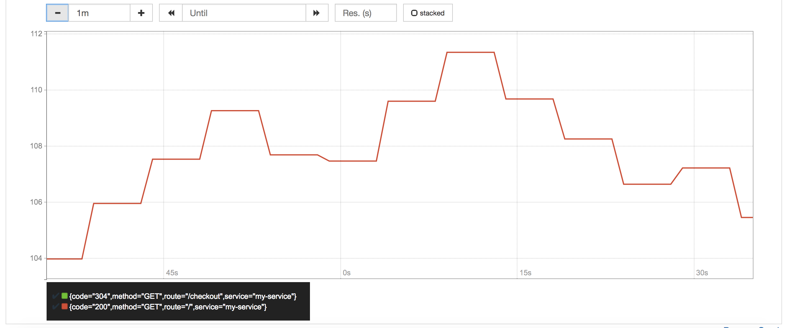

### Deploy a local Prometheus and Grafana stack with Docker Compose

Steps 1-2 are already done for the lab VM and `prometheus` repo is located in `/root/prometheus`.

1). Clone the `prometheus` docker compose repository from Github:

```
git clone https://github.com/vegasbrianc/prometheus
```

2). Add scraping job definition to the Prometheus configuration file `prometheus/prometheus/prometheus.yml` by adding (uncommenting in the lab VM) the following code within `scrape_config` section:

```
  - job_name: 'btm-nodejs'
    scrape_interval: 5s
    static_configs:
    - targets: ['xxx.xxx.xxx.xxx:3001']
      labels:
        service: 'my-service'
        group: 'production'

```
replace xxx.xxx.xxx.xxx with your own host machine's IP.

3). Start Prometheus & Grafana stack:
   
```
cd <cloned-prometheus-docker-compose-repo-dir>
docker-compose up -d
```
Expected output:
```
Creating network "prometheus_back-tier" with the default driver
Creating network "prometheus_front-tier" with the default driver
Creating prometheus_cadvisor_1      ... done
Creating prometheus_alertmanager_1  ... done
Creating prometheus_node-exporter_1 ... done
Creating prometheus_prometheus_1    ... done
Creating prometheus_grafana_1       ... done

```

Verify that Prometheus started via: [http://localhost:9090](http://localhost:9090/graph)


## Run example PromQL queries

### Throughput

#### Error rate

Range[0,1]: number of 5xx requests / total number of requests

```
sum(increase(http_request_duration_ms_count{code=~"^5..$"}[1m])) /  sum(increase(http_request_duration_ms_count[1m]))
```

#### Request Per Minute

```
sum(rate(http_request_duration_ms_count[1m])) by (service, route, method, code)  * 60
```

### Response Time

#### Apdex

[Apdex](https://en.wikipedia.org/wiki/Apdex) score approximation: `100ms` target and `300ms` tolerated response time

```
(sum(rate(http_request_duration_ms_bucket{le="100"}[1m])) by (service) + sum(rate(http_request_duration_ms_bucket{le="300"}[1m])) by (service)
) / 2 / sum(rate(http_request_duration_ms_count[1m])) by (service)
```

> Note that we divide the sum of both buckets. The reason is that the histogram buckets are cumulative. The le="100" bucket is also contained in the le="300" bucket; dividing it by 2 corrects for that. - [Prometheus docs](https://prometheus.io/docs/practices/histograms/#apdex-score)

#### 95th Response Time

```
histogram_quantile(0.95, sum(rate(http_request_duration_ms_bucket[1m])) by (le, service, route, method))
```

#### Median Response Time

```
histogram_quantile(0.5, sum(rate(http_request_duration_ms_bucket[1m])) by (le, service, route, method))
```

#### Average Response Time

```
avg(rate(http_request_duration_ms_sum[1m]) / rate(http_request_duration_ms_count[1m])) by (service, route, method, code)
```


### Memory Usage

#### Average Memory Usage

In Megabyte.

```
avg(nodejs_external_memory_bytes / 1024 / 1024) by (service)
```

## Configure Prometheus alert
Alerting rules allows to define alert conditions based on Prometheus expression language expressions and to send notifications about firing alerts to an external service. In this lab we will configure one alerting rule for median response time higer than 100ms.

**Lab instruction:**

Add the following alert rule to the `alert.rules` file. In the lab VM it is located in `/root/prometheus/prometheus/alert.rules`

```
  - alert: APIHighMedianResponseTime
    expr: histogram_quantile(0.5, sum by(le, service, route, method) (rate(http_request_duration_ms_bucket[1m])))
      > 30
    for: 1m
    annotations:
      description: '{{ $labels.service }}, {{ $labels.method }} {{ $labels.route }}
        has a median response time above 100ms (current value: {{ $value }}ms)'
      summary: High median response time on {{ $labels.service }} and {{ $labels.method
        }} {{ $labels.route }}
```


## Reload config

Necessary when you modified Prometheus configuration.

```sh
curl -X POST http://localhost:9090/-/reload
```

Alerts can be listed via Prometheus UI: [http://localhost:9090/alerts](http://localhost:9090/alerts)

States of active alerts: 

- `pending`:


- `firing`:


## Set the Prometheus datasource in Grafana

Verify the prometheus datasource configuration in Grafana. If it was not already configured, [create](http://docs.grafana.org/features/datasources/prometheus/#adding-the-data-source-to-grafana) a Grafana datasource with this settings:

+ name: prometheus
+ type: prometheus
+ url: http://localhost:9090
+ access: browser


## Configure dashboard

Grafana Dashboard to [import](http://docs.grafana.org/reference/export_import/#importing-a-dashboard): `btm-nodejs-grafana.json`
Or use this curl request:

Monitoring dashboard was created according to RED Method principles:

- Rate (`Thoughput` and `Checkouts` panels)
- Errors (`Error rate` panel)
- Duration (`95th Response Time` and `Median Response Time` panels)


Review the configuration of each dashboard panel. Check the [annotation](http://docs.grafana.org/reference/annotations/) settings.

**Lab instruction:**
Define Apdex score chart using the following query:

```
(sum(rate(http_request_duration_ms_bucket{le="100"}[1m])) by (service) + sum(rate(http_request_duration_ms_bucket{le="300"}[1m])) by (service)
) / 2 / sum(rate(http_request_duration_ms_count[1m])) by (service)
```