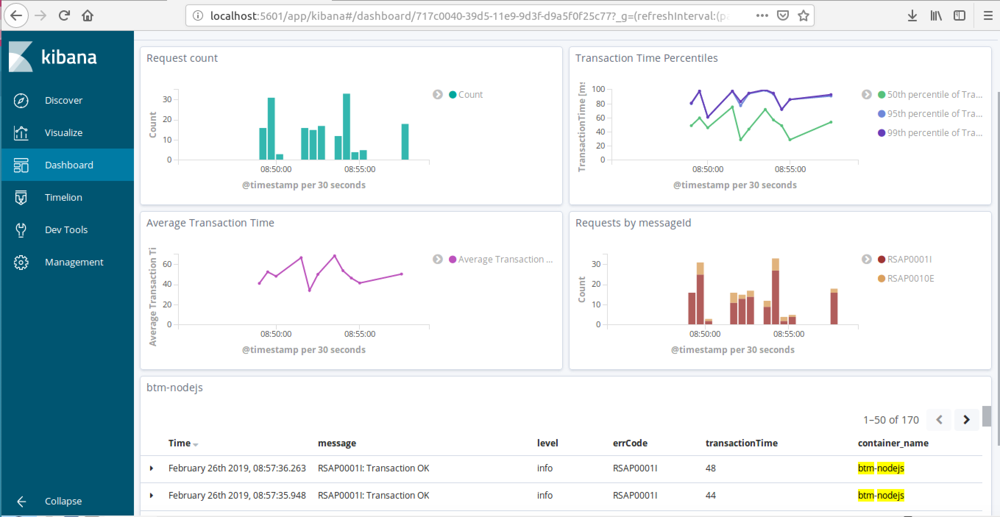

A production service should have both logging and monitoring. Monitoring provides a real-time and historical view on the system and application state, and alerts you in case a situation is met. In most cases, a monitoring alert is simply a trigger for you to start an investigation. Monitoring shows the symptoms of problems. Logs provide details and state on individual transactions, so you can fully understand the cause of problems.

Logs provide visibility into the behavior of a running app, they are one of the most fundamental tools for debugging and finding issues within your application. If structured correctly, logs can contain a wealth of information about a specific event. Logs can tell us not only when the event took place, but also provide us with details as to the root cause. Therefore, it is important that the log entries are readable to humans and machines. 

According to the [12-factor](https://12factor.net/) application guidelines, logs are the stream of aggregated, time-ordered events. A twelve-factor app never concerns itself with routing or storage of its output stream. It should not attempt to write to or manage log files. Instead, each running process writes its event stream, unbuffered, to stdout. If you deviate from these guidelines, make sure that you address the operational needs for log files, such as logging to local files and applying log rotation policies.


## Configure the logging library

Go to the directory where the `server.js` file is located and run the following command to install and configure a [winston](http://github.com/winstonjs/winston) logging library for node.js.
```
cd b2m-nodejs/src
npm install --save winston
```
this should add the following dependency to the `package.json`:

```
    "winston": "^3.2.1"
```

## Example implementation of logging

Add/uncomment the following line at the beginning of `server.js` to load the `winston` module:

```js
const { createLogger, format, transports } = require('winston')
```
then create the `logger` object:

```js
const logger = createLogger({
  level: 'debug',
  format: format.combine(
    format.timestamp({
      format: "YYYY-MM-DD'T'HH:mm:ss.SSSZ"
    }),
    format.json()
  ),
  transports: [new transports.Console()]
});
```

The configuration above specifies timestamp field format and enables sending logs in `json` format to STDOUT.
Timestamp should include the time zone information and be precise down to milliseconds. 

Whenever you want to generate a log entry, just use the `logger` object with level specified methods: **error**, **warn**, **info**, **verbose**, **debug**

```js
msg = 'RSAP0010E: Severe problem detected'
logger.error(msg)
msg = 'RSAP0001I: Transaction OK'
logger.info(msg)
```

You can add also additional metadata like `errorCode` or `transactionTime` that can be useful in log analytics.

Extend your logger statement like on the example below. Additional metadata will be used later in our log analytics dashboard. Look for commented lines starting with `logger` and uncomment it.

```js
msg = 'RSAP0001I: Transaction OK'
logger.info(msg, {"errCode": "RSAP0001I", "transactionTime": delay})

msg = 'RSAP0010E: Severe problem detected'
logger.error(msg, {"errorCode": "RSAP0010E", "transactionTime": delay})
```

Restart the application (`ctrl-c` in the terminal window and start with `npm start server.js` after every code change). 

Example STDOUT (in the application terminal window):

```json
{"errCode":"RSAP0001I","transactionTime":81,"level":"info","message":"RSAP0001I: Transaction OK","timestamp":"2019-02-27T07:34:49.625Z"}
{"errCode":"RSAP0010E","transactionTime":76,"level":"error","message":"RSAP0010E: Severe problem detected","timestamp":"2019-02-27T07:34:50.008Z"}
{"errCode":"RSAP0001I","transactionTime":22,"level":"info","message":"RSAP0001I: Transaction OK","timestamp":"2019-02-27T07:34:50.325Z"}
{"errCode":"RSAP0001I","transactionTime":1,"level":"info","message":"RSAP0001I: Transaction OK","timestamp":"2019-02-27T07:34:50.620Z"}
{"errCode":"RSAP0001I","transactionTime":96,"level":"info","message":"RSAP0001I: Transaction OK","timestamp":"2019-02-27T07:34:50.871Z"}
{"errCode":"RSAP0001I","transactionTime":62,"level":"info","message":"RSAP0001I: Transaction OK","timestamp":"2019-02-27T07:34:51.156Z"}
```


>After testing of the logging features, stop the application.

Commit your changes to your GiHub repository:

```
cd /root/b2m-nodejs
git commit -am "I added logging to my app!"
git push
```

## Create a Docker image for node.js application

Use provided `Dockerfile` to build application container:

```
cd b2m-nodejs/src
docker build -t b2m-nodejs .
```

## Integrate with the Elastic stack
The following procedure shows how to send the application logs to the local Elastic stack running in Docker.

### Deploy a local Elastic stack with Docker Compose

During this lab we will run the Elastic Stack (Elasticsearch, Logstash, Kibana) in the Docker Compose.
Configuration for this lab is based on https://github.com/deviantony/docker-elk.
Elastic stack docker compose project in located `/root/docker-elk`

Briefly review the simple logstash configuration we use for this lab: `/root/docker-elk/logstash/pipeline/logstash.conf`:

```
input {
    gelf { port => 5000 }
}

filter {
    json { source => "message" }
    #we need level field in a numeric format
    mutate {
     gsub => [
      "level", "info", 6,
      "level", "error", 3
     ]
    }
    mutate {
     convert => { "level" => "integer" }
    }
}

output {
    elasticsearch {
        hosts => "elasticsearch:9200"
    }
    stdout { codec => rubydebug }
}
```

The above will reconfigure logstash to use `gelf` (Graylog Extended Log Format) protocol supported by Docker log driver, so we can directly stream application logs to Logstash using `gelf`.

4). Start the Elastic stack:
   
```
cd /root/docker-elk
docker-compose up -d
```
Expected output:
```
Creating network "docker-elk_elk" with driver "bridge"
Creating docker-elk_elasticsearch_1 ... done
Creating docker-elk_kibana_1        ... done
Creating docker-elk_logstash_1      ... done
```
5). Verify you can access Kibana on `http://localhost:5601`

### Start node.js application container and forward logs to Elastic stack

Make sure the Start application container with this command:

```
docker run --name btm-nodejs -d -p 3001:3001 --log-driver=gelf \
--log-opt gelf-address=udp://localhost:5000 b2m-nodejs
```

Simulate a couple fo transactions using `Firefox` or `curl` by accessing `http://localhost:3001/checkout` URL and check if you can see application log records in Kibana.

In the lab environment, the Elastic stack has been preconfigured, so the example Dashboard and Visualizations should be available in Kibana out of the box.

You can also import Kibana configuration using provided `btm-nodejs-kibana.json`:

- Go to Kibana: `http://localhost:5601`
- Click on Management -> Saved Objects -> Import
- Select `btm-nodejs-kibana.json`

Simulate a couple fo transactions using `Firefox` or `curl` by accessing `http://localhost:3001/checkout` and check out the Kibana dashboard: `BTM Node.js`

It should be similar to:


Stop and remove the node.js Docker container before starting the next exercise.

```
docker stop btm-nodejs
docker rm btm-nodejs
```

